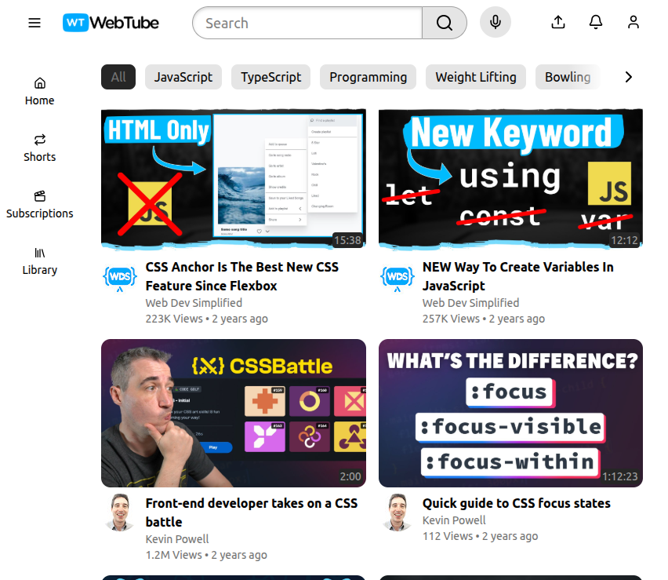

# YouTube Home Page Clone

This simple web page showcases the knowledge I acquired while learning **React** and **Tailwind CSS**. It represents one of my first projects built with React, with a focus on component-based development and responsive design.

All resources and layout ideas were inspired by a YouTube tutorial from **Web Dev Simplified**, used as a learning challenge.

## 📸 Preview

Here are some screenshots of the project:




## 🚀 Features

- Responsive layout that adapts to mobile, tablet, and desktop screens
- Custom **Button** component for consistent button styling
- Custom **VideoGridItem** component to display each video card
- Sidebar that changes its layout dynamically based on screen size, managed using **React Context**

## 🛠️ Technologies Used

- React
- Tailwind CSS
- React Context API

## 📦 Installation

To run this project locally, follow the steps below:

### 1. Clone the repository

```bash
git clone https://github.com/your-username/youtube-home-clone.git
```

### 2. Navigate into the project folder

```bash
cd youtube-home-clone
```

### 3. Install dependencies

```bash
npm install
```

### 4. Start the development server

```bash
npm run dev
```

Make sure you have Node.js and npm installed.
